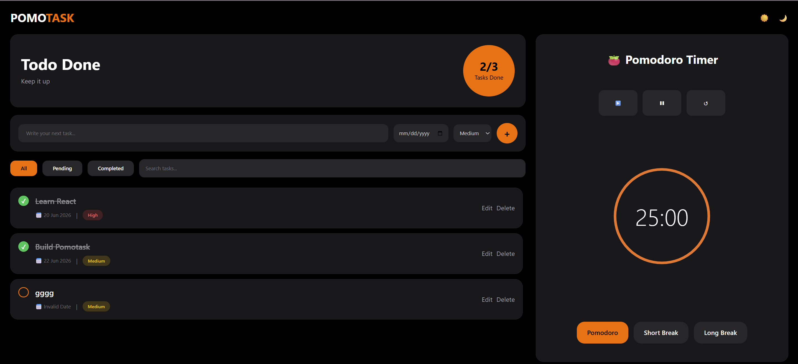

# PomoTask

PomoTask is a modern productivity application that combines task management with the Pomodoro Technique to help users stay organized and focused. It enables users to manage daily tasks efficiently while improving productivity through structured work and break sessions.

Built with **React**, **Vite**, **Tailwind CSS**, and **JSON Server**, the application features a clean, responsive interface and persistent task storage.

---

## Features

### Task Management
- Create, edit, and delete tasks
- Mark tasks as completed or pending
- Assign due dates and priority levels
- Track completed tasks with a live progress summary

### Search & Filtering
- Search tasks instantly by title
- Filter tasks by:
  - All
  - Pending
  - Completed

### Pomodoro Timer
- 25-minute focus sessions
- 5-minute short breaks
- 15-minute long breaks
- Start, pause, and reset controls
- Circular progress indicator

### User Experience
- Responsive design
- Clean and modern UI
- Smooth animations and hover effects
- Loading and error handling
- Persistent task data using JSON Server

---

## Tech Stack

| Category | Technology |
|----------|------------|
| Frontend | React, JavaScript |
| Styling | Tailwind CSS |
| Build Tool | Vite |
| Backend | JSON Server |
| State Management | React Hooks (`useState`, `useEffect`) |

---

## Project Structure

```text
PomoTask
│
├── public/
├── src/
│   ├── components/
│   ├── App.jsx
│   ├── main.jsx
│   └── index.css
│
├── db.json
├── package.json
└── README.md
```

---

## Getting Started

### Clone the repository

```bash
git clone https://github.com/<your-username>/pomotask.git
```

### Install dependencies

```bash
npm install
```

### Start the frontend

```bash
npm run dev
```

### Start the backend

```bash
npm run server
```

The application will be available at:

- Frontend: `http://localhost:5173`
- Backend: `http://localhost:3001`

---

## Screenshots

| Dashboard |
|-----------|
|  |

| Task Management | Pomodoro Timer |
|-----------------|----------------|
|  |  |

---

## Future Improvements

- User authentication
- Drag and drop task ordering
- Task categories and labels
- Notifications and reminders
- Cloud database integration

---

## Learning Outcomes

This project helped strengthen my understanding of:

- Building reusable React components
- State management with React Hooks
- CRUD operations and REST API integration
- Responsive UI design with Tailwind CSS
- Component-based application architecture

---

## License

This project is licensed under the MIT License.
